```{r setup, eval=TRUE, echo=FALSE, message=FALSE}

###################
## Chunk options ##
###################
knitr::opts_chunk$set(cache = FALSE, echo = FALSE, fig.width = 4, fig.height = 4)

##############
## Packages ##
##############
library(lubridate)
library(plotly)
library(RColorBrewer)
library(tidyverse)
library(showtext)

###############
## Variables ##
###############
daysOfWeek <- c("Monday", "Tuesday", "Wednesday", "Thursday", "Friday")
dayStart <- 6.5
dayEnd <- 22.5
themeBlue <- "#359942"

###############
## Functions ##
###############
source("include/helpers.R")

rinline <- function(code) {
  sprintf('`r %s`', code)
}

set.seed(1234)

```

```{r xaringan-themer, include = FALSE}

library(xaringanthemer)
duo_accent(white_color = "#ffffff",
           black_color = "#212121",
           text_bold_color = "#7e2e7a",
           primary_color = "#132E6F",
           secondary_color = "#359942",           
           link_color = "#00a0df",
           title_slide_background_color = "#ffffff",
           title_slide_text_color = "#212121",
           text_font_family = "Verdana",
           header_font_family = "Verdana",
           code_font_family = "Hack",
           header_font_weight = "bold")

```

# Disclaimer

- The views presented in these slides are my own and do not necessarily reflect the position of my company (Johnson & Johnson).
- All data displayed in this presentation are anonymized, sample, or simulated actigraphy data.

???

- Give some background on me personally to fill in the bio, if needed

---

# Fatigue and Sleep Disturbance are Prevalent Symptoms

- Digital health technologies, such as activity trackers, may provide a novel way to measure impacts of fatigue and sleep disturbances in patients with chronic immune diseases.

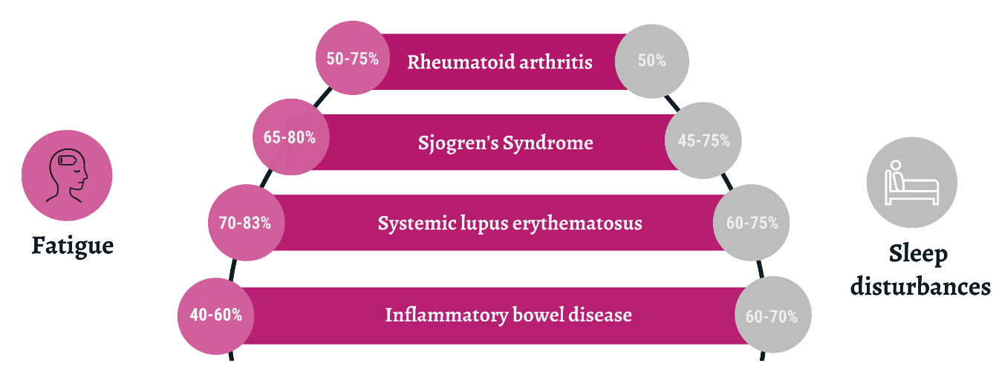

???

- Prevalence in many chronic immune-mediated inflammatory diseases is above 50%
  for fatigue and sleep disturbance
- New tools are needed to understand the real impact of these symptoms on
  patient's daily lives.
- This schematic is taken from one of those initiatives, the IMI-funded project IDEA-FAST (Identifying Digital Endpoints of Fatigue and Sleep Disturbance) 

---

# Introduction to Actigraphy

.pull-left[
- Actigraphy is a **non-invasive** method of monitoring human rest/activity patterns through monitoring of **movement**.
- Often, a small wrist-watch with a built-in **accelerometer** is used to collect **actigraphy** data.
- Example derived data include: step count, time in intense physical activity, sleep time.

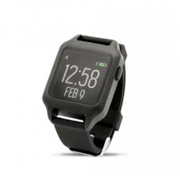
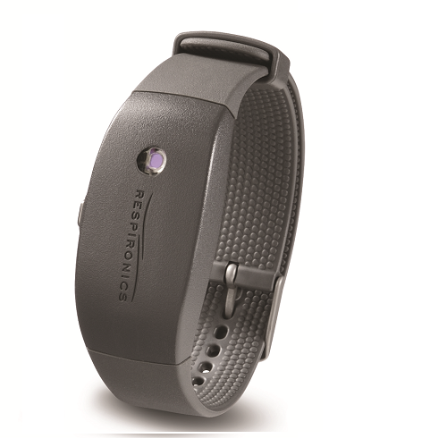
]

.pull-right[
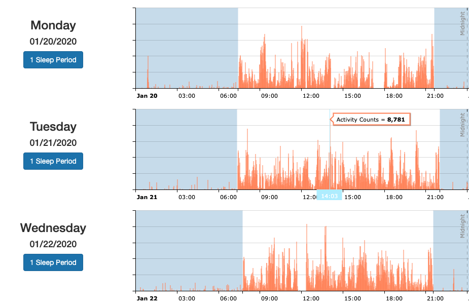
]

???

- Actigraphy watches have accelerometers which measure movement in 3 axes (x, y, z)
- What's shown on the right is a summarized "activity count" which summarizes
  the amount of movement detected by the accelerometer in 1 minute **epochs**
  over a full 24-hour day.

---

# Why Create Personalized Activity Reports?

- We want to **provide value** to study participants with the data we are already collecting
  - Study participants expect it from consumer wearables.
- Typically the data collected in clinical trials is not shared with study participants (prevent unblinding, prevent biasing patient-reported data, QC'ed data not available in real-time)

<center>
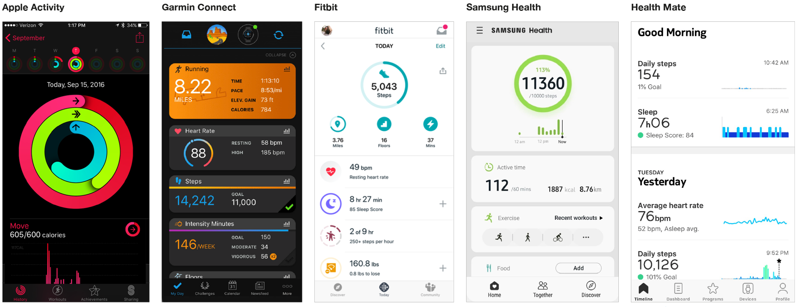
</center>

???

- We wanted to provide value while also making sure we...
  - Prevent biasing data
  - Ensure data privacy
  - Increase patient engagement (drive better compliance)

---

# Automated Creation of Activity Reports with Shiny

- Internal Shiny app was built to interactively create participant reports

<center>
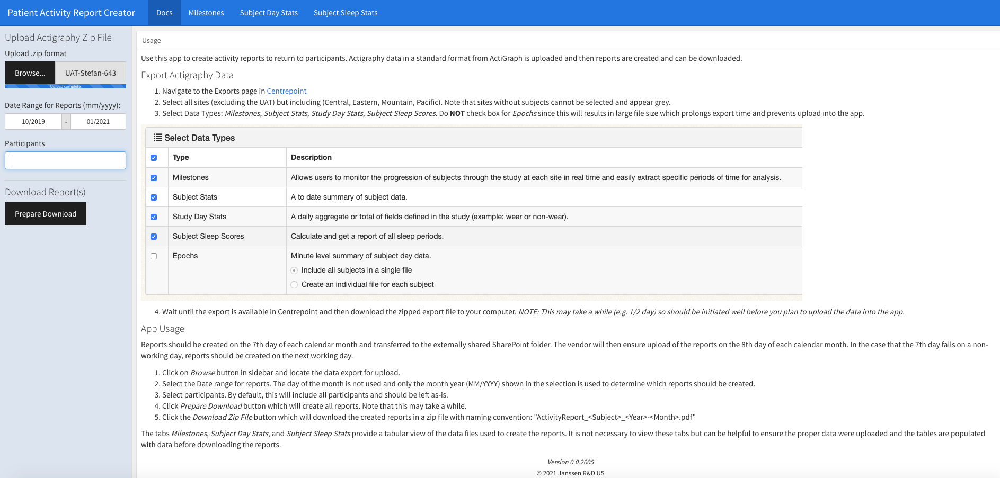
</center>

???

- Semi-Automated Workflow
  - Export Data from ActiGraph (actigraphy vendor's) dashboard
  - Upload data file into Shiny app
  - Select months and participants
  - Download a batch of activity reports
  - Transferred from Janssen to the virtual site to add to participant app/web portal.
- Workflow could be automated by pulling data from the vendor's API.

---

# Activity Report in Phase 0 Study

.left-column[
- Ongoing Phase 0 Observational Study including a research-grade actigraphy watch
- Built a report and process for data sharing **during the study**
- Static PDF report with activity/sleep summary metrics
- Providing a report per participant per month
]

.right-column[
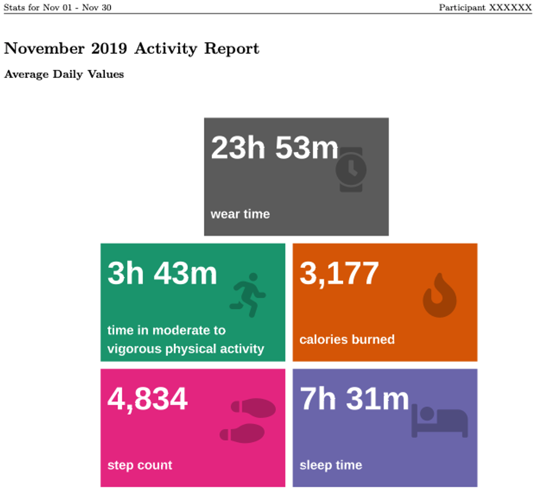
]

???

- Screenshot here shows the first page of the mock report which was delivered as a monthly summary.
- Initially had grand plans of making this like consumer-facing app but due to limitations with technology we were using we could not integrate directly into the study mobile app or use HTML / interactive plots. 
  - Had to use static PDF summaries available via the study mobile app or online dashboard as downloads
  

---

# Activity Report in Phase 0 Study

.left-column[
- Report is built using Rmarkdown and rendering to PDF
- All visualizations are created using R code
]

.right-column[
```{r tile_plot, eval = FALSE, echo = FALSE}

ggplot(df, aes(x, y, height = h, width = w, label = info)) +
    geom_tile(aes(fill = info)) +
    geom_text(color = "white", fontface = "bold", size = 10,
              aes(label = value, x = x - 2.9, y = y + 1),
              hjust = 0) +
    geom_text(color = "white", fontface = "bold", size = 4,
              aes(label = info, x = x - 2.9, y = y - 1.25),
              hjust = 0) +
    coord_fixed() +
    scale_fill_manual(values = colors) +
    geom_text(aes(label = shape, x = x + 1.85, y = y + 0.3,
                  family = family),
              size = 14, alpha = 0.25) +
    theme_void() +
    guides(fill = FALSE)

```
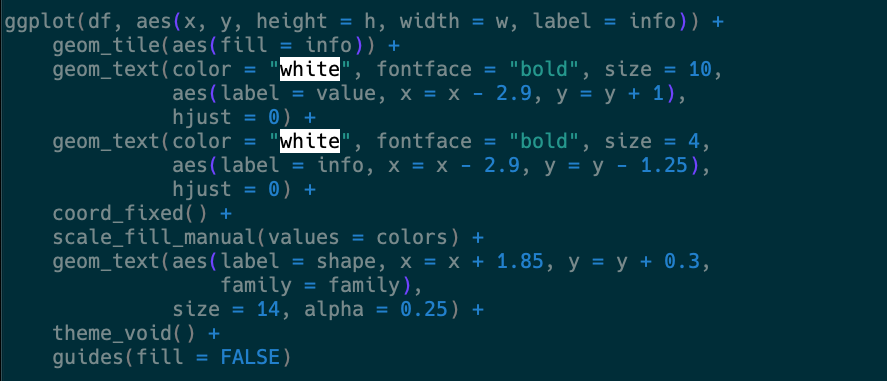
.center[For more details, see [my answer on Stack Overflow](https://stackoverflow.com/questions/47105282/valuebox-like-function-for-static-reports/56841865#56841865)]
]

???

- Create the tiles with `geom_tile()` using the `color` column
- Add the numeric values as text in `value` column
- Add the labels for each box stored in the `info` column
- Use `geom_text()` to add the icons by specifying the unicode symbol.

---

# Example Plot in Activity Report

.left-column[
- Daily plots of step count, sleep time, and time spent in moderate-to-vigorous physical activity (MVPA)
]

.right-column[
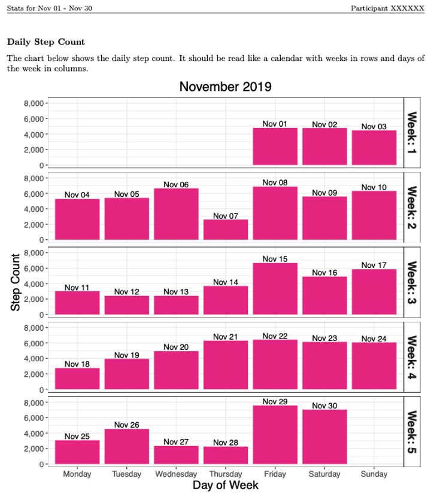
]

???

- Snapshot of average of the daily values for the entire month in calendar-like layout
- Given only after study participants complete the daily and weekly patient reported outcomes.
- A disclaimer was included: "This information in this report is for informational purposes only and not to be considered as medical advice. This information is not intended to diagnose, prescribe, treat, or cure any medical condition..."

---

# Example Plot in Activity Report

.left-column[
- R code to generate daily bar charts.
]

.right-column[
```{r step_plot, eval = FALSE, echo = FALSE}

ggplot(data = plot_data) +
    geom_bar(stat = "identity", fill = "#e7298a",
             aes(x = Day, y = WearFilteredSteps)) +
    geom_text(aes(x = Day, label = Act_Text, y = 0, vjust = -1)) +
    geom_text(aes(x = Day, y = WearFilteredSteps, label = Date_Text,
                  vjust = -0.25)) +
    scale_y_continuous(labels = function(x) comma(x, accuracy = 1)) +
    coord_cartesian(ylim = ylim) +
    facet_grid(Week ~ ., labeller = label_both) +
    ylab("Step Count") +
    xlab("Day of Week") +
    ggtitle(format.Date(date, "%B %Y")) +
    getBaseTheme()

```
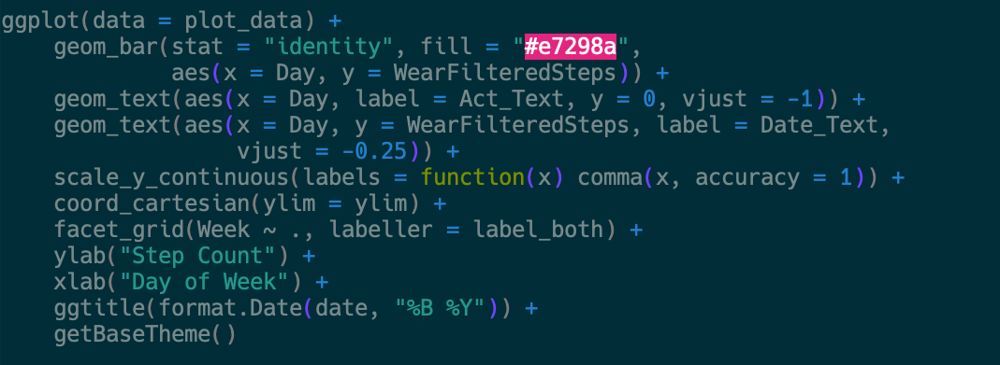
]

???

- The code for this plot is very simple in ggplot2 consisting of mainly `geom_bar()` and `geom_text` calls.

---

# Future Directions - Towards Interactivity

- Actigraphy data is rich in density (monthly, weekly, daily, minute-level, etc.) and can be displayed in many different ways.
- More research is needed to understand the best way to visualize the data and what data study participants want to see.
- Interactive graphics are currently being explored as a way for the study team to engage with the data. 
- Interactive graphics could also be a way to engage participants who really want to understand their data
  - Drilling down into intra-day data
  - Understanding changes in weekly summary statistics over time

---

# Beautiful Visualizations

.left-column[
- Visualization of 4 months of sleep times in a newborn.
- Blue represents sleep times on a 24-hour clock with each ring representing 1 day.
]

.right-column[

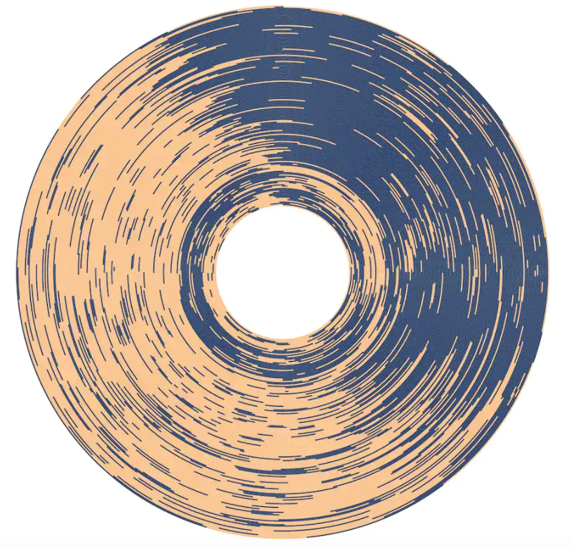
source: <a href="https://www.reddit.com/r/dataisbeautiful/comments/5l39mu/my_daughters_sleeping_patterns_for_the_first_4/dbskzid/" target="_blank">Redditor andrew_elliott</a>
]
???

- Daughter's sleeping patterns in the first 4 months of her life. One continuous spiral starting on the inside when she was born, each revolution represents a single day.
- Could imagine something like this being very interesting and beautiful and published in a scientific journal but not so much for general consumption. Just a pretty picture to most people.

---

# Interactives - Doughnut Charts

```{r}

act_df <- data.frame(Asleep = 0.7,
                      Awake_Immobile = 0.05,
                      Awake_Active = 0.15,
                      Awake_HighlyActive = 0.10) %>%
    gather(key = "Type", value = "fraction")


```

```{r, fig.height = 4, fig.width = 6, echo = TRUE, warning = FALSE}

act_df %>%
  plot_ly(labels = ~Type, values = ~fraction) %>%
  add_pie(hole = 0.5) %>%
  layout(showlegend = TRUE,
         xaxis = list(showgrid = FALSE, zeroline = FALSE,
                      showticklabels = FALSE),
         yaxis = list(showgrid = FALSE, zeroline = FALSE,
                      showticklabels = FALSE))

```

???

- Doughnut chart is just like a pie chart with a hole in it
- Way to show percent of time spent in different (mobility) states
- Click around to show they are interactive and not static

---

# 

<!-- NOTE: Update the dashboard to turn off the legend in doughnut plot -->
<!-- Can actually include the dashboard itself but doesn't render well -->
<iframe src="include/patient_dashboard.html" height="600" width = "1000"></iframe>

<!-- <\!-- Show a screenshot of the dashboard instead -\-> -->
<!-- <center> -->
<!-- 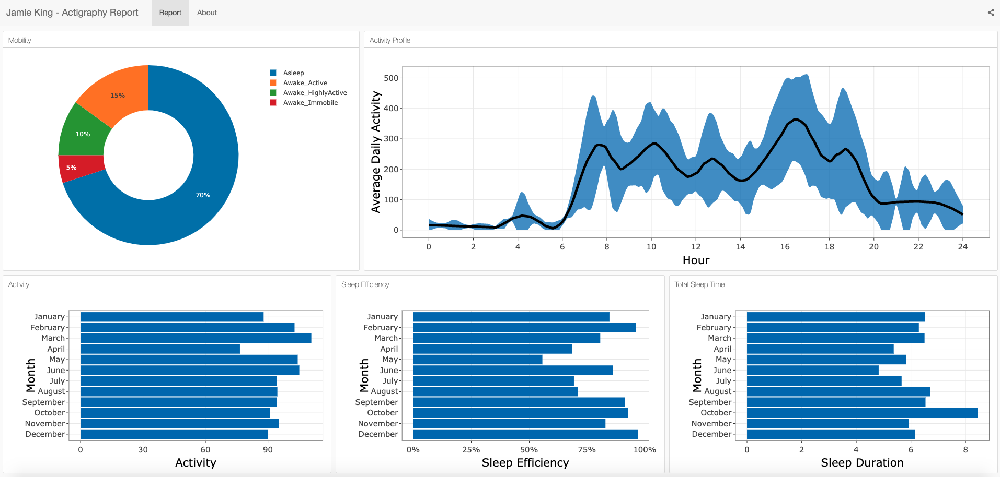 -->
<!-- </center> -->

???

- Full blown dashboards can be created as HTML files and...
- Can host this on patient community portal
- Or can send as a standalone HTML file that allows patients to explore the data
- We are currently working to understand what our study participants would want to see

---

# Summary

- Inclusion of digital health tools, such as actigraphy, are increasingly used in clinical trials to better understand patient's activity, sleep, and activities of daily living.
- If we want to increase voluntary participation, compliance, and engagement we should in my opinion provide some data back to study participants
  - Need to think carefully about how to do this depending the study objective (during or after study, what type of data is understandable , etc.)
- Showed an example of how we have **visualized actigraphy data** to create **personalized activity reports** using an **interactive shiny dashboard** in a phase 0 study.
- Future work will improve upon these reports as we learn what information study participants want to see and as we leverage new technologies for sharing data with study participants.

???

- In addition to using the data for research, that data can be summarized in a way that is value for study participants. 

